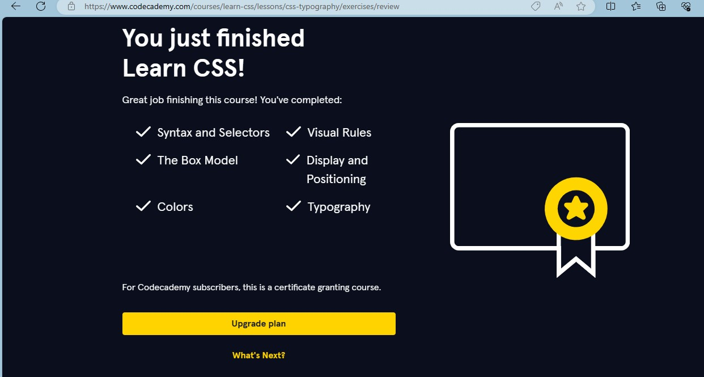
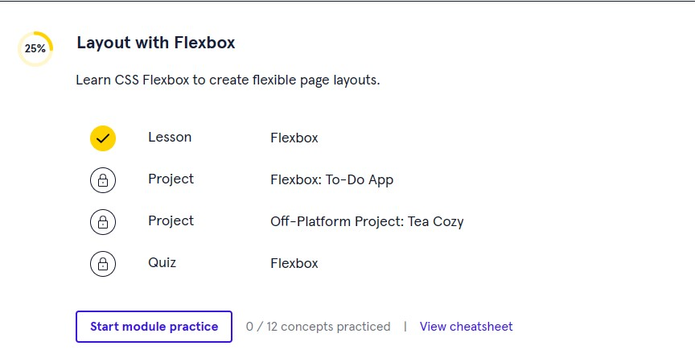
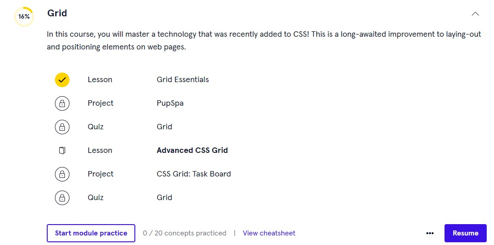

# w4p1-css_codeacademy

1. Selesaikan course pada url https://www.codecademy.com/enrolled/courses/learn-css dan https://www.codecademy.com/enrolled/courses/learn-intermediate-css
2. Screen capture bukti penyelesaian tiap syllabus dibawah:
    - Syntax and Selector
    - Visual Rules
    - The Box Model
    - Display and Positioning
    - Colors
    - Typography
    - Layout with flexbox
    - Grid
#Jawab

- Syntax and Selector
- Visual Rules
- The Box Model
- Display and Positioning
- Colors
- Typography

- Layout with flexbox

- Grid